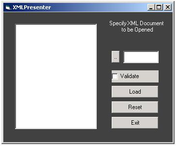



## XML To TreeView

### Description

It is very efficient code that loads an XML Document into a TreeView recursively.Also it has the ability to validate the XML document according to DTD specified in XML Document.
 
### More Info
 
XML Document

The user should be aware of XML and VB.

             |
---                |---
**Submitted On**   |2002-06-12 15:13:00
**By**             |[khurram riaz](https://github.com/Planet-Source-Code/PSCIndex/blob/master/ByAuthor/khurram-riaz.md)
**Level**          |Beginner
**User Rating**    |4.8 (19 globes from 4 users)
**Compatibility**  |VB 5\.0, VB 6\.0
**Category**       |[Miscellaneous](https://github.com/Planet-Source-Code/PSCIndex/blob/master/ByCategory/miscellaneous__1-1.md)
**World**          |[Visual Basic](https://github.com/Planet-Source-Code/PSCIndex/blob/master/ByWorld/visual-basic.md)
**Archive File**   |[XML\_To\_Tre933616122002\.zip](https://github.com/Planet-Source-Code/khurram-riaz-xml-to-treeview__1-35747/archive/master.zip)

